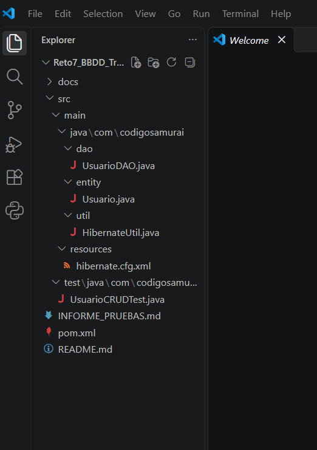
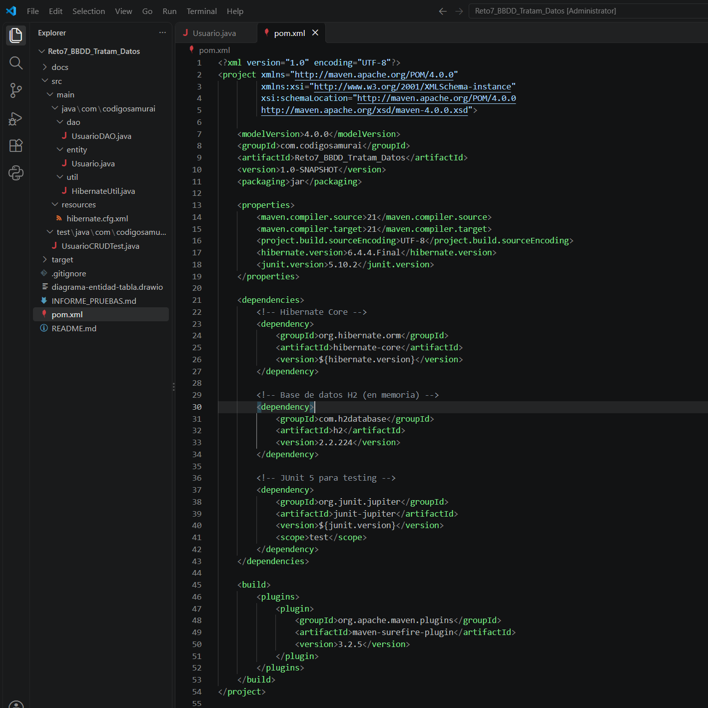
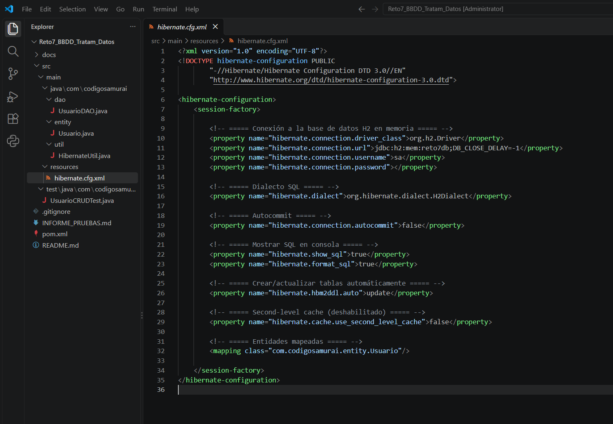
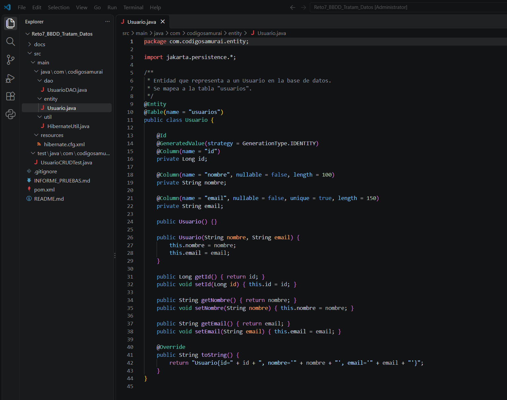
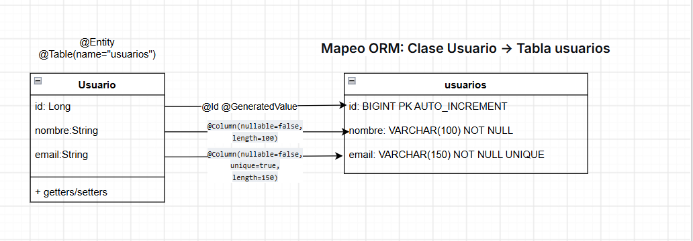
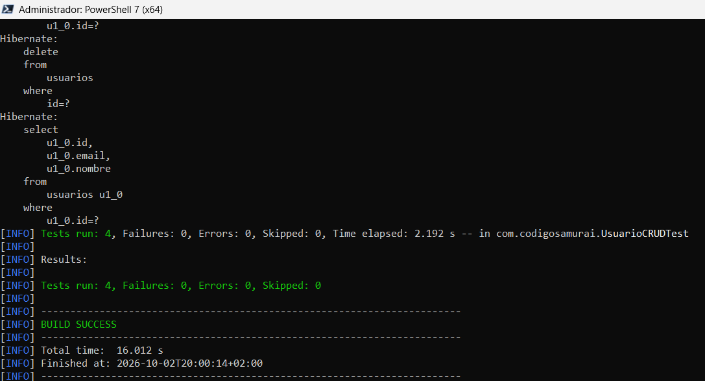
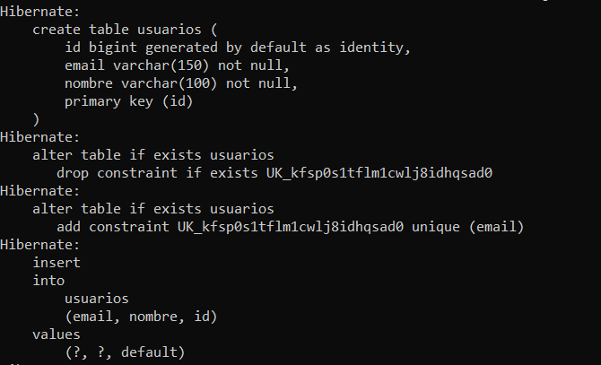

# ⚔️ Reto 7 — Configuración de Hibernate y CRUD de Usuarios

**Curso**: Desarrollo Web con Frameworks 4  
**Alumno**: Judit Giravent Pineda  
**Fecha**: Octubre 2026  
**Repositorio**: [GitHub - everest9957/Reto7_BBDD_Tratam_Datos](https://github.com/everest9957/Reto7_BBDD_Tratam_Datos)

---

## 🛠️ Tecnologías utilizadas


| Tecnología  | Versión   | Propósito                          |
|-------------|-----------|-------------------------------------|
| Java        | 21 LTS    | Lenguaje principal                  |
| Maven       | 3.9.11    | Gestión de dependencias             |
| Hibernate   | 6.4.4     | ORM (mapeo objeto-relacional)       |
| H2 Database | 2.2.224   | Base de datos en memoria            |
| JUnit       | 5.10.2    | Framework de pruebas unitarias      |
| draw.io     | —         | Diagrama del mapeo ORM              |

---

## 🎯 Objetivo del reto

Configurar **Hibernate** en un proyecto Java con **Maven** para mapear la
entidad `Usuario` a una tabla en base de datos, e implementar las
operaciones **CRUD** (Crear, Leer, Actualizar, Eliminar) usando
`SessionFactory`, `Session` y transacciones.

El proyecto forma parte del contexto narrativo "Código Samurái", donde los
descendientes del clan **Minamoto** están reconstruyendo su historia
creando una base de datos de guerreros.

---

## 📂 Estructura del proyecto

### Figura 1 — Estructura del proyecto



**Figura 1.** Estructura Maven estándar del proyecto. Se distinguen tres
zonas principales: `src/main/java` (código de producción dividido en
`entity`, `dao` y `util`), `src/main/resources` (archivo de configuración
de Hibernate) y `src/test/java` (pruebas unitarias JUnit 5).

```
Reto7_BBDD_Tratam_Datos/
├── pom.xml
├── .gitignore
├── README.md
├── docs/
│   ├── capturas/
│   ├── diagramas/
│   └── INFORME_PRUEBAS.md
└── src/
    ├── main/
    │   ├── java/com/codigosamurai/
    │   │   ├── entity/Usuario.java
    │   │   ├── util/HibernateUtil.java
    │   │   └── dao/UsuarioDAO.java
    │   └── resources/hibernate.cfg.xml
    └── test/java/com/codigosamurai/UsuarioCRUDTest.java
```

---

## ⚙️ Configuración paso a paso

### 1. Dependencias Maven

#### Figura 2 — Dependencias declaradas en `pom.xml`



**Figura 2.** El `pom.xml` declara las dependencias principales:

- **`org.hibernate.orm:hibernate-core:6.4.4.Final`**: núcleo del ORM
  Hibernate. Proporciona `SessionFactory`, `Session`, `Transaction` y las
  anotaciones JPA (`@Entity`, `@Table`, `@Column`).
- **`com.h2database:h2:2.2.224`**: motor de base de datos embebido en
  memoria. Se usa como base de datos de pruebas y desarrollo, evitando
  instalar un SGBD externo.
- **`org.junit.jupiter:junit-jupiter:5.10.2`** (scope `test`): framework
  de pruebas unitarias. Solo se incluye en el classpath de test.

También se define la propiedad `maven.compiler.source` y
`maven.compiler.target` a **Java 21**, que es la versión LTS utilizada
como base del proyecto.

### 2. Configuración de Hibernate

#### Figura 3 — Archivo `hibernate.cfg.xml`



**Figura 3.** El archivo `hibernate.cfg.xml` en `src/main/resources`
define la sesión de Hibernate mediante el elemento `<session-factory>`:

- **Conexión a la base de datos**:
  - `hibernate.connection.driver_class` → `org.h2.Driver`
  - `hibernate.connection.url` → `jdbc:h2:mem:reto7db;DB_CLOSE_DELAY=-1`
  - `hibernate.connection.username` → `sa`
  - `hibernate.connection.password` → vacío
- **Dialecto SQL**: `hibernate.dialect` → `org.hibernate.dialect.H2Dialect`.
- **Autocommit**: `hibernate.connection.autocommit` → `false` (transacciones
  explícitas con `session.beginTransaction()`).
- **Logging**: `show_sql=true` y `format_sql=true`.
- **Generación de esquema**: `hbm2ddl.auto=update`.
- **Second-level cache**: `cache.use_second_level_cache=false`.
- **Mapeo**: `<mapping class="com.codigosamurai.entity.Usuario"/>`.

### 3. Entidad `Usuario`

#### Figura 4 — Entidad con anotaciones JPA/Hibernate



**Figura 4.** Clase `Usuario` anotada como entidad JPA. Cada elemento
contribuye al mapeo objeto-relacional:

- **`@Entity`**: marca la clase como entidad gestionada por Hibernate.
- **`@Table(name = "usuarios")`**: indica el nombre exacto de la tabla.
- **`@Id`**: señala el atributo `id` como clave primaria.
- **`@GeneratedValue(strategy = GenerationType.IDENTITY)`**: delega la
  generación del ID a la base de datos (columna autoincremental).
- **`@Column(name = "nombre", nullable = false, length = 100)`**: aplica
  `NOT NULL` y `VARCHAR(100)`.
- **`@Column(name = "email", nullable = false, unique = true, length = 150)`**:
  aplica `NOT NULL`, `UNIQUE` y `VARCHAR(150)`.

Se usa **`jakarta.persistence.*`** (en lugar de `javax.persistence.*`)
porque Hibernate 6.x adoptó la especificación Jakarta EE 9+.

### 4. Diagrama del mapeo ORM

#### Figura 5 — Diagrama entidad ↔ tabla



**Figura 5.** Diagrama del mapeo objeto-relacional entre la clase Java
`Usuario` (izquierda) y la tabla `usuarios` en la base de datos H2
(derecha). Cada flecha representa la correspondencia entre un atributo y
su columna equivalente:

| Atributo Java   | Anotación JPA                                                       | Columna SQL                          |
|-----------------|---------------------------------------------------------------------|--------------------------------------|
| `Long id`       | `@Id @GeneratedValue(strategy = IDENTITY) @Column(name = "id")`     | `id BIGINT PK AUTO_INCREMENT`        |
| `String nombre` | `@Column(name = "nombre", nullable = false, length = 100)`          | `nombre VARCHAR(100) NOT NULL`       |
| `String email`  | `@Column(name = "email", nullable = false, unique = true, length = 150)` | `email VARCHAR(150) NOT NULL UNIQUE` |

Las **anotaciones JPA** actúan como puente entre el mundo de objetos
(Java) y el mundo relacional (SQL), evitando escribir manualmente las
sentencias DDL y DML: Hibernate las genera automáticamente a partir de
las anotaciones.

> El archivo editable del diagrama está disponible en
> [`docs/diagramas/diagrama-entidad-tabla.drawio`](docs/diagramas/diagrama-entidad-tabla.drawio).

### 5. Operaciones CRUD

El DAO `UsuarioDAO` implementa las cuatro operaciones:

```java
public void guardar(Usuario usuario);          // CREATE - session.persist()
public Usuario obtenerPorId(Long id);          // READ   - session.get()
public List<Usuario> obtenerTodos();           // READ   - createQuery
public void actualizar(Usuario usuario);       // UPDATE - session.merge()
public void eliminar(Long id);                 // DELETE - session.remove()
```

Cada operación abre una `Session` desde la `SessionFactory` de
`HibernateUtil`, ejecuta la operación dentro de una transacción y cierra
la sesión automáticamente mediante `try-with-resources`.

---

## 🧪 Ejecución de pruebas

```bash
mvn clean test
```

### Figura 6 — Resultado de los tests



**Figura 6.** Resultado de ejecutar `mvn clean test`. Se observa:

- **`Tests run: 4`**: se ejecutaron los cuatro casos de prueba definidos
  en `UsuarioCRUDTest`: `testGuardarUsuario`, `testObtenerTodos`,
  `testActualizarUsuario` y `testEliminarUsuario`.
- **`Failures: 0`**: ninguna aserción falló.
- **`Errors: 0`**: no se lanzaron excepciones inesperadas.
- **`Skipped: 0`**: todos los tests fueron ejecutados.
- **`BUILD SUCCESS`**: el ciclo `clean → compile → test` se completó
  correctamente.

El orden de ejecución está garantizado por
`@TestMethodOrder(OrderAnnotation.class)` junto con `@Order(1..4)`, de
modo que los tests se ejecutan secuencialmente y cada uno depende del
estado dejado por el anterior:

1. **Test 1 (CREATE)** → inserta un `Usuario` ("Kenshin").
2. **Test 2 (READ)**   → consulta la lista completa.
3. **Test 3 (UPDATE)** → modifica el nombre a "Kenshin Himura".
4. **Test 4 (DELETE)** → elimina el usuario y comprueba que ya no existe.

Esta captura es la evidencia principal de que el mapeo ORM, la
configuración de Hibernate y las operaciones CRUD funcionan correctamente
contra la base de datos H2 en memoria.

### Figura 7 — SQL generado por Hibernate



**Figura 7.** Salida de consola con `show_sql=true` y `format_sql=true`.
Hibernate genera automáticamente el SQL específico del dialecto
(`H2Dialect`) a partir de las anotaciones JPA:

**DDL** (`hibernate.hbm2ddl.auto=update`):

```sql
create table usuarios (
    id bigint generated by default as identity,
    email varchar(150) not null,
    nombre varchar(100) not null,
    primary key (id)
)

alter table if exists usuarios
   add constraint UK_kfsp0s1tflm1cwlj8idhqsad0 unique (email)
```

**DML** (uno por operación CRUD):

```sql
-- INSERT (crear)
insert into usuarios (email, nombre, id) values (?, ?, default)

-- SELECT (leer)
select u1_0.id, u1_0.email, u1_0.nombre from usuarios u1_0

-- UPDATE (actualizar)
update usuarios set email=?, nombre=? where id=?

-- DELETE (eliminar)
delete from usuarios where id=?
```

Esto demuestra el rol del ORM: el desarrollador trabaja con objetos Java
y Hibernate traduce a SQL parametrizado (con `?`), evitando la inyección
SQL y desacoplando la aplicación del SGBD concreto.

---

## 🚀 Cómo ejecutar el proyecto

```bash
# 1. Clonar el repositorio
git clone https://github.com/everest9957/Reto7_BBDD_Tratam_Datos.git
cd Reto7_BBDD_Tratam_Datos

# 2. Compilar y ejecutar tests
mvn clean test

# 3. (Opcional) Empaquetar
mvn package
```

**Requisitos**:

- JDK 17+ (probado con **JDK 21**)
- Maven 3.8+ (probado con **Maven 3.9.11**)

---

## 📄 Informe de pruebas

Ver [`docs/INFORME_PRUEBAS.md`](docs/INFORME_PRUEBAS.md) para el detalle
completo de los casos de prueba, resultados y conclusiones.

---

## 📚 Documentación adicional

- [Hibernate 6.4 User Guide](https://docs.jboss.org/hibernate/orm/6.4/userguide/html_single/Hibernate_User_Guide.html)
- [JSR 338 - JPA 2.2](https://jcp.org/en/jsr/detail?id=338)
- [H2 Database](https://www.h2database.com/)
